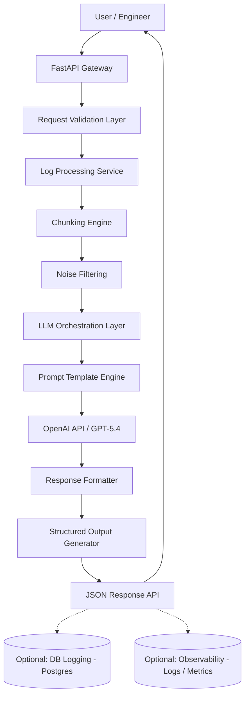

# Log Sage AI

Turn logs into answers

---

### 📌 Overview

AI-powered log analyzer that transforms raw application logs into clear summaries, probable root causes, and actionable recommendations.

---

### 🚀 Features
- `/analyze`: Paste log directly 
-  Understandable feedback (summary, root cause, severity, recommendation) using GPT 5.4

--- 

### 🛠 Tech Stack
- Language: Python
- Libraries: Uvicorn, FastAPI, OpenAI

---

### 📂 Project Structure

```
logsage-ai/
│── app.py  
│── routes/ 
│── services/
│── models/ 
│── utils/ 
│── README.md 
│── requirements.txt 
│── .env 
```

### 📐 Architecture Diagram

---

### ⚙️ Installation
#### Requirements: 
- Python 3.14.4
- Git
- Create .env file (API key storage)
- API Key from OpenAI

Follow these steps to set up and run the project locally.
#### 1. Clone the repository (Terminal or Command Prompt):

``git clone https://github.com/yourusername/project-name.git``

##### 2. Navigate to the Project Folder
```cd project-name```

##### 3. Create virtual environment
``` python3 -m venv .venv ```
##### 4. Activate the Virtual Environment
``` 
macOS / Linux: source .venv/bin/activate
Windows: .venv\Scripts\activate 
```
#### 5. Install Dependencies
``` pip install -r requirements.txt ```
#### 6. Run the Project
``` uvicorn main:app --reload ```
#### 7. Access the API
Once running, open:
- App: http://127.0.0.1:8000
- Swagger Docs: http://127.0.0.1:8000/docs
- ReDoc Docs: http://127.0.0.1:8000/redoc

---

### 📘 Leaning Points
- OpenAI for analysis
- FastAPI implementation
- Organized backend implementation

---

### 🔮 Future Improvements
- Feature: - `/upload-log`:  File Upload with preprocessing
- **Preprocessing**: Handles large log information omits unnecessary information and focus on errors and relevant information.
- Token Management: Because of **preprocessing** feature, request tokens are handled efficiently
- Feature: Project Exclusive Analysis using memory of previous logs
    - Insight per developer or project etc
    - `/insights`  - summarizes the most common errors / warnings encountered
    - `/topics` -  Sprint retro topics or for DEV only meetings (expands knowledge + avoidance
- Feature: Seamless integration with a production ready system
- Computer Use Agent  - skip the human upload part and periodically reads the logs 
- QOL: Token management

---

### 📄 License

MIT-License

---

### 👨‍💻 Author
- Name: Luiz Santos
- GitHub: https://github.com/luizsantos-github